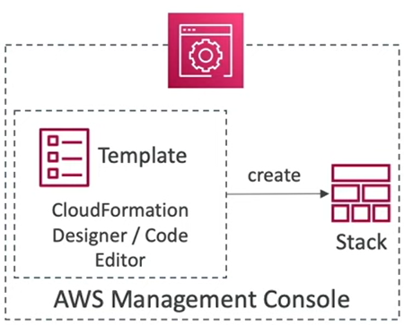
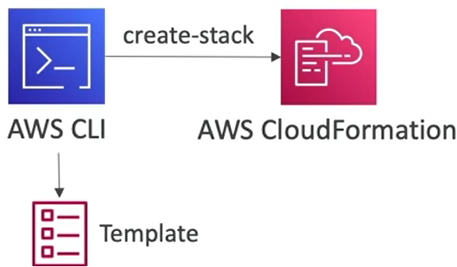

# AWS CloudFormation

CloudFormation is a declaritive way of outlining your AWS Infrastructure, for any resources (most of them are supported).

For example, within a CloudFormation template, you say:

- I want a security group
- I want two EC2 machines using this security group
- I want two Elastic IPs for these EC2 machines
- I want an S3 bucket
- I want a load balancer (ELB) in front of these machines

The CloudFormation creates those for you, in the __right order__, with the __exact configuration__ that you specify.

The whole definition of your whole architecure is in one file. That file is declaritive.

## Deploying CloudFormation templates

- Manual way:
  - Editing templates in CloudFormation Designer or code editor
  - Using the console to input parameters, etc......
  - We'll mostly do this way in the course for learning purposes

- Automated way:
  - Editing templates in a YAML file
  - Using the AWS CLI (Command Line Interface) to deploy the templates, or using a Continuous Delivery (CD) tool
  - Recommended way when you fully want to automate your flow

## AWS CloudFormation Building Blocks

Template's components:

1. AWSTempateFormatVersion: identifies the capabilities of the template ("2010-09-09")
2. Description: comments about the template
3. Transform: specifies one or more Macros that used to process the template
4. Metadata
5. __Resources: your AWS resources declared in the template (MANDATORY)__
6. Parameters: the dynamic inputs for your template
7. Mappings: the static variables for your template
8. Outputs: References to what has been created
9. Conditionals: List of conditions to perform resource creation
10. Rules: validate a parameter(s) during stack creation/update

Template's helpers:

1. References
2. Functions

## AWS CloudFormation Update Behaviour

- CloudFormation updates resources based on differences between what you submit and stack's current template
- Which method to use depends on which property you update for a resource
- __Update with No Interruption__
  - Without disrupting resources' operation & without changing physical ID
  - Example: updating the IAM instace profile __(IamInstanceProfile)__ of an EC2 instance
- __Update with Some Interruption__
  - Example: updating an EC2 instance type __(InstanceType)__ from t2.micro to t2.large - requires for the instance to be restarted
- __Replacement__
  - Recreating the resource with new physical ID
  - Creates the new resource, change references from other resources to the new resource, then deletes the old resource
  - Example: updating an RDS DB Instance availability zone __(AvaliabilityZone)__
