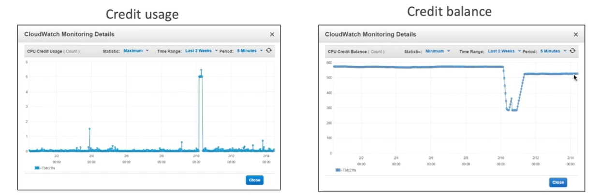
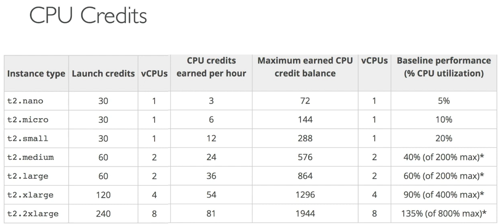
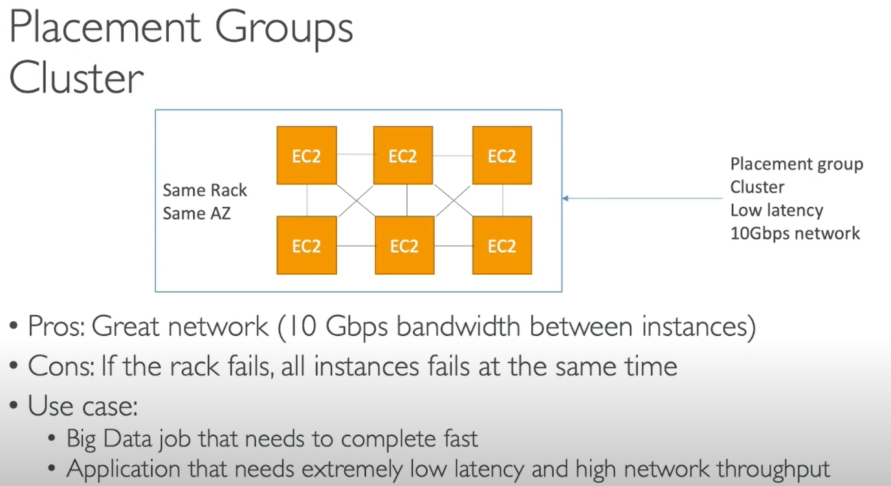
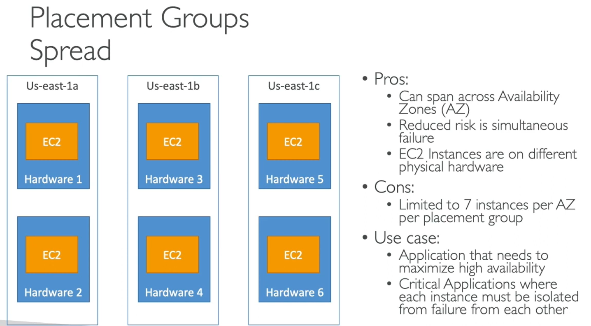
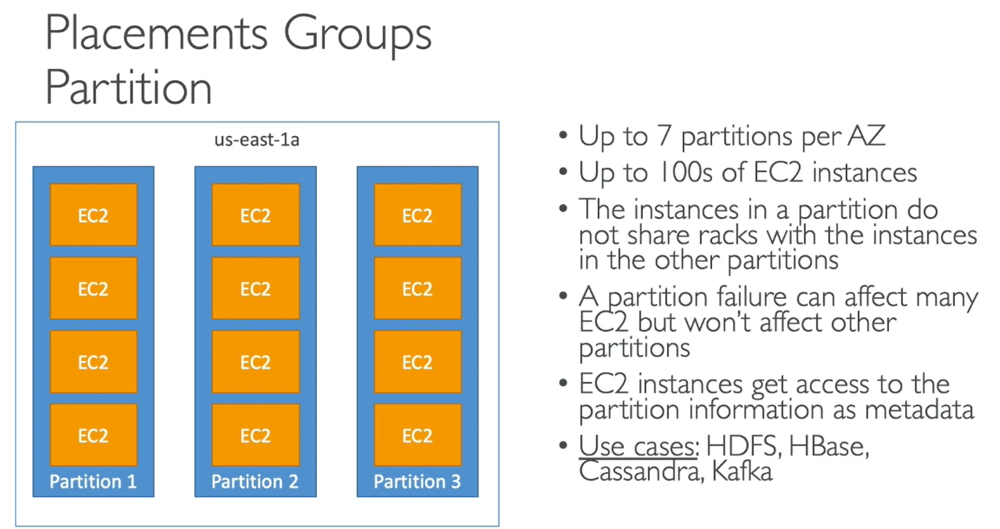

# EC2

This file is dedicated for EC2 Instance.

Amazon EC2 - Virtual Servers in the Cloud

- Limited by RAM and CPU
- Continously running
- Scaling means intervention to add/remove servers

## EC2 Instance Launch Types

- On Demand Instances: short workload, predictable pricing
- Reserved Instances: long workloads (>= 1 year)
  - Convertible Reserved Instances: long workloads with flexible instances
  - Scheduled Reserved Instances: launch within time window you reserve
- Spot Instances: short workloads, for cheap, can lose instances
- Dedicated Instances: no other customers will share your hardware
- Dedicated Hosts: book an entire physical server, control instance placement

### EC2 On Demand

- Pay for what you use (billing per second, after the first minute)
- Has the highest cost but no upfront payment
- No long term commitment

Usecase:

- Recommended for short-term and un-interrupted workloads, where you can't predict how the application will behave.

### EC2 Reserved Instance

- Up to 75% discount compared to On-demand
- Pay upfront for what you use with longterm commitment
- Reservation period can be 1 to 3 years
- Reserve a specific instance type
- Recommended for steady state usage applications (think database)

- __Convertible Reserved Instance:__
  - can change the EC2 instance type
  - up to 54% discount
- __Scheduled Reserved Instances__
  - launch within time window you reserve
  - When you require a fraction of day/week/month

### EC2 Spot Insances

- Can get a discount of up to 90% compared to On-demand
- You bid a price and get the instance as long as its under the price
- Price will varie based on offer and demand
- Spot instances are reclaimed with a 2 minute notification watrning when the spot price goes above your bid

Usecase:

- Used for batch jobs, Big Data analysis, or workloads that are resilient to failures.

### EC2 Dedicated Hosts

- Physical dedicated EC2 server for your use
- full control of EC2 Instance placement
- Visibility into underlying sockets / physical cores of the hardware
- Allocated for your account for a 3 year period reservation
- More expensive

Usecase:

- Useful for software that have complicated licensing model (BYOL - Bring Your Own License)
- For companies that have strong regulatory or compliance needs

### EC2 Dedicated Instances

- Instances running on hardware that's dedicated to you
- May share hardware with other instances in same account
- No control over instance placement (can move hardware after Stop/Start)

### Which host is right for me

## EC2 Instances Types - Main ones

- R: applications that needs a lot of RAM -in-memory caches
- C: applications that needs good CPU - compute / databases
- M: applications that are balanced (think "medium") - general / web app
- i: applications that need good local I/O (instance storage) - databases
- G: applications that need a GPU - video rendering / machine learning

Burstable instances (T2/T3)

- T2/T3: burstable instances (up to a capacity)
- T2/T3 - unlimited

__Real-world tip:__ use <https://ec2instances.info> - it contains information about the instance types.

### Burstable Instances (T2/T3)

- AWS has the concept of burstable instances (T2/T3 machines)
- Bust means that overall, the instance has OK CPU performance.
- When the machine needs to process something unexpected (a spike in load for example), it can burst, and CPU can be VERY good during that burst.
- If the machine bursts, it utilizes "burst credits"
- If all the credits are gone, the CPU becomes Bad  :(
- If the machine stops bursting, credits are accumulated over time

Burstable instances can be amazing to handle unexpected trqaffix and getting the insurance that it will be handled correctly

If your instance consistently runs low on credit, you need to move to a different kind of non-burstable instance

Cloudwatch can show you the Credit usage and balance:

CPU credits:

### T2/T3 Unlimited

- It is possible to have an "unlimited burst credit balance"
- You pay extra money if you go over your credit balance, but you don't lose performance

Overall be careful, costs could go high if you're not monitoring the health of your instances.

## Shutdown Behaviour

- __Shutdown behaviour:__ How should the instance react when shutdown is done using the OS?
  - Stopped: default
  - Terminated

- This is not applicable from AWS console or AWS API.
- CLI Attribute: `InstanceInitiatedShutdownBehavior`

### Termination Protection

- Enable termination protection: to protect against accidental termination in AWS Console or CLI

- __Exam Tip:__
  - We have an instance where shutdown behavior = terminate and enable terminate protection is ticked
  - We shutdown the instance from the OS, what will happen?
    - The instance will still be terminated.

### Placement Groups

Sometimes you want to control over EC2 Instance placement strategy.  
That strategy can be defines using placemnet groups.  
When you create a placement group, you specify one of the following strategied for the group:

- Cluster -- clusters instances into low-latency group in a ssingle Availability Zone.
- Spread -- spreads instances across underlying hardware(max 7 instances per group per AZ) - critical applications
- Partition -- spreads instances across many different partitions (which rely on different sets of racks) within an AZ. Scales to 100s of EC2 instances per group (Hadoop, Cassandra, Kaftka).

#### Placement Groups - Cluster

#### Placement Groups - Spread

#### Placement Groups - Partition

- Partitions are different set of racks

## Cloudwatch Metrics for EC2

- AWS Procided metrics (AWS pushes them):
  - Basic Monitoring (default): metrics are collected a 5 minute interval
  - Detailed Monitoring (paid): metrics are collected at 1 minute interval
  - Includes CPU, Network, Disk and Status check Metrics

- Custom metric (yours to push):
  - Basic Resolution: 1 minute resolution
  - High resolution: all the way to 1 second resolution
  - Include RAM, application level metrics
  - Make sure the IAM permissions on the EC2 instance role are correct!

### EC2 included metrics

- __CPU:__ CPU Utilization + Credit Usage / Balance
- __Network:__ Network In/Out
- __Status Check:__
  - Instance status = check the EC2VM
  - System status = check the underlying hardware
- __Disk:__ Read/Write for Ops/Bytes (only for instance store)

__Note:__ _Ram is not included in the AWS metrics_

## EC2 Pricing

- EC2 instances prices (per hour) varies based on these parameters:
  - Region you're in
  - Instance Type you're using
  - On-Demand vs Reserved vs Dedicated Host
  - Linux vs Windows vs Private OS (RHEL, SLES, Windows SQL)
- You are billed by the second, with a minimum of 60 seconds
- You also pay for other factors such as storage, data transfer, fixed IP public addresses, load balancing
- __You do not pay for the instance if the instance is stopped__

### EC2 Pricing Example

- t2.small in US-EAST-1 (VIRGINIA), cost $0.023 per Hour
- If used for:
  - 6 seconds, it costs $0.023/60 = $0.000383 (minimum of 60 seconds)
  - 60 seconds, it costs $0.023/60 = $0.000383 (minimum of 60 seconds)
  - 30 minutes, it costs $0.023/2 = $0.0115
  - 1 month, it costs $0.023 * 24 * 30 = $16.56 (assuming a month is 30 days)
  - X seconds (X> 60), it costs $0.023 * X / 3600
- The best way to know the pricing is to consult the pricing page: <https://aws.amazon.com/ec2/pricing/on-demand/>

## EC2 Instances Overview

- Instances have 5 distinct characteristics advertised on the website:
  - The TAM (type, amount, generation)
  - The CPU (type, make, frequency, generation, number of cores)
  - The I/O (disk performance, EBS optimisations)
  - The Network (network bandwidth, network latency)
  - Graphical Processing Unit (GPU)
- It may be daunting to choose the right instance type (there are over 50 of them) - <https://aws.amazon.com/ec2/instance-types/>
- <https://ec2instances.info/> can help with summarizing the types of instances
- R/C/P/G/H/X/I/F/Z/CR are specialised in RAM, CPU, I/O, Network, GPU
- M instance types are balanced
- T2/T3 instance types are "burstable"
