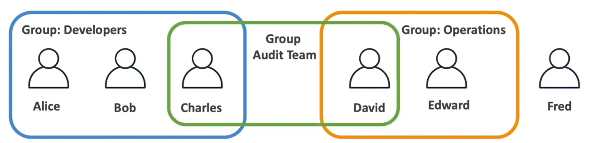

# AWS IAM

- __IAM__ - Identity and Access Managment, Global service (does not require region selection)
- Root account created by default, shouldn't ne used or shared
- Users are people within your organization, and can be grouped

__note:__ - groups can only contain users, not other groups
__note:__ - people can belong to different groups.

Example:



## IAM: Permissions

- __Userts or Groups__ can be assigned JSON documents called policies:
  example json:
  
  ```json
  {
      "Version": "2012-10-17"
      "Statement": [
          {
              "Effect": "Allow",
              "Action": "ec2:Describe*",
              "Resource": "*"
          },
          {
              "Effect": "Allow",
              "Action": "ec2:Describe*",
              "Resource": "*"
          },
          {
              "Effect": "Allow",
              "Action": [
                  "cloudwatch:ListMetrics",
                  "cloudwatch:GetMetricStatistics",
                  "cloudwatch:Describe*"
              ],
              "Resource": "*"
          },
      ]
  }
  ```

- These policies define __permissions__ of the users
- In AWS you apply the __least privilege principle__: don't give more permissions than a user needs

## IAM Roles for Services

- Some AWS service will need to perform actions on your behalf
- To do so, we will assign permissions to AWS services with __IAM Roles__

Common Roles:

- EC2 Instance Roles
- Lambda Function Roles
- Roles for CloudFormation

## IAM - Password Policy

- In AWS you can setup a password policy with different options
  - Set a minimum password length
  - Require a specific character types:
    - including uppercale letters
    - lowercase letter
    - numbers
    - non-alphanumeric characters
  - Allow all IAM users to change their own passwords
  - Require users to change their password after some time (password expiration)
  - Prevent password re-use

### IAM - Multi Factor Authentication - MFA

- Users have access to your account and can possibly change configurations or delete resources in your AWS account
- You want to protect your Root Accounts and IAM users
- MFA = password you know + security device you own

- Main benefit of MFA:  
  if a password is stolen or hacked, the account is not compromised

__MFA devices options in AWS:__

- Virtual MFA device
  - Google Authenticator (phone only)
  - authy (multi-device)
- Universal 2nd Factor (U2F) Security Key
  - YubiKey by Yubico (3rd party)
- Hardware Key Fob MFA Device
