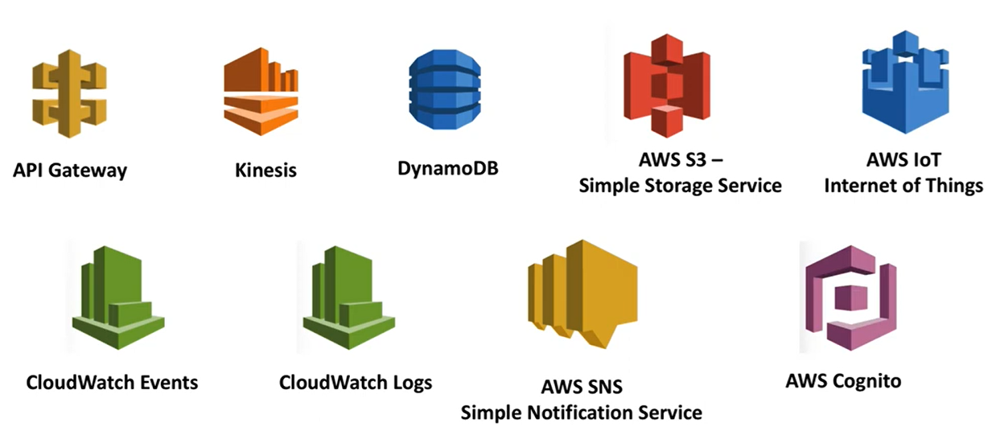
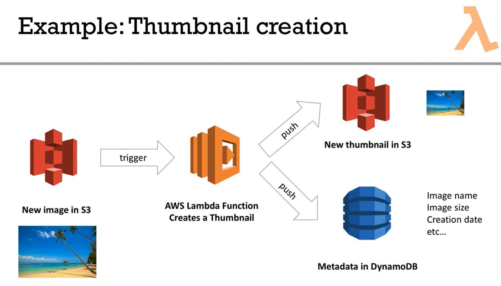

# Lambda

Lambda is a serverless service were you can only pay in case of computer usage. No charche, when it's not running.

- lambda responds to events happening
- lambda casn scale based on the load.
- cost is linked to the invocations (times it run) and the how long the invocations lasted

AWS Lambda - virtual functions - no servers to manage! :)

- Limited by time - short executions
- run on-demand
- scaling is automated

__Benefits:__

- Easy pricing:
  - Pay per request and compute time
  - Free tier of 1,000,000 AWS Lambda requests and 400,000 GBs of compute time
- Integrated with the whole AWS Stack
- Integrated with many programming languages
- Easy monitoring through AWS CloudWatch
- Easy to get more resources per functions (up to 1,5GB of RAM!)
- Increasing RAM will also improve CPU and network.

## AWS-Lambda - known languages

- aws-nodejs (* common?)
- aws-python (* common?)
- aws-python3
- aws-groovy-gradle
- aws-java-gradle
- aws-java-maven
- aws-scala-sbt
- aws-csharp

## AWS-Lambda Integrations - Main Ones

- API-Gateway
- Kinesis
- DynamoDB
- AWS S3-Simple Storage Service
- AWS IoT - internet og Things
- CloudWatch Events
- CloudWatch Logs
- AWS SNS Simple Notification Service
- AWS Cognito

__Example:__ Thumbnail creation

1. Somebody uploads a picture in S3.
2. S3 bucket will send a trigger to AWS Lambda function. Lambda function in only triggered, when there is a new image.
3. Lambda function pushes the image in S3. It can also push some metadata to DynamoDB.

## Exam Tips

- By default, AWS Lambda runs your functions in a secure VPC with access to AWS services and the internet. Lambda owns this VPC, which is not connected to your account's default VPC. When you [connect a Lambda function to a VPC](https://docs.aws.amazon.com/lambda/latest/dg/configuration-vpc.html#vpc-internet) in your account to access private resources, the function cannot access the internet unless your VPC provides access. Internet access from a private subnet requires network address translation (NAT). To give your function access to the internet, route outbound traffic to a NAT gateway in a public subnet.
