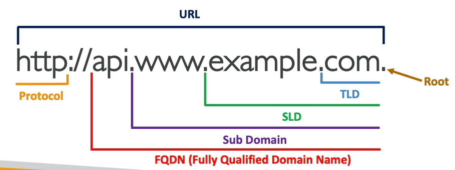

# AWS Route 53

AWS Route 53 is a managed DNS (Domain Name System)

53 is a reference to the traditional DNS port.

## What is DNS?

- Domain Name System which translates the human friendly hostnames into the machine IP addresses

- <www.google.com> => 172.17.18.36
- DNS is the backbone of the Internet
- DNS uses hierarchical naming structure

### DNS Terminologies

- Domain Registrar: Amazon Route 53, GoDaddy, ...
- DNS Records: A, AAAA, CNAME, NS, ...
- ZOne File: contains DNS records
- Name Server: resolves DNS queries (Authoritative or Non-Authoritative)
- Top Level Domain (TLD):.com, .us, .in, .gov, .org, ...
- Second Level Domain (SLD): amazon.com, google.com, ...

## Amazon Route 53 overview

- A Hihgly available scalable, fully managed and authoritative DNS
  - Authoritative = the customer can update the DNS records
- Route 53 is also a Domain Registrar
- Ability to check the health of your resources

## Route 53 - Record Types

- __A__ - maps a hostname to IPv4
- __AAAA__ - maps a hostname to IPv6
- __CNAME__ - maps a hostname to another hostname
  - The target is a domain name which must have an A or AAAA record
  - Can't create a CNAME record for the top node of a DNS namespace (Zone Apex)
  - Example: you can't create for <example.com>, but you can create for <www.example.com>
- __NS__ - Name Servers for the Hosted Zone
  - Controls how the traffic is routed for a domain

## Route 53 - Hosted Zones

- A container for records that define how to route traffic to a domain and its subdomains.
- Public Hosed Zones - contains records that specify how to route traffic on the internet (public domain names)
- Private Hosted Zones - contain records that specify how you route traffic within one or more VPCs (private domain names)
