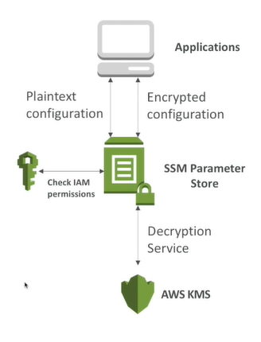
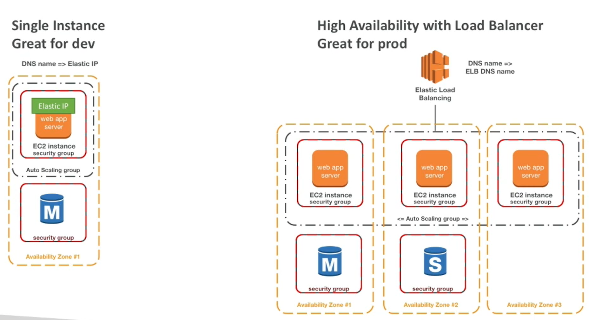
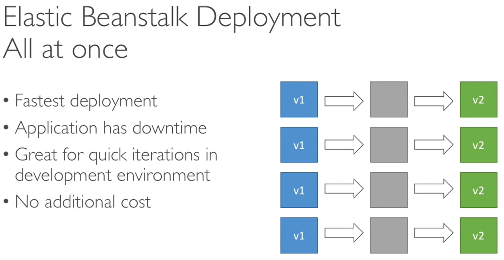
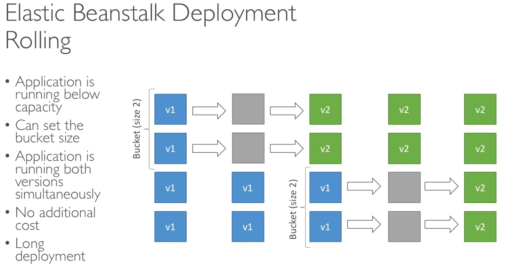
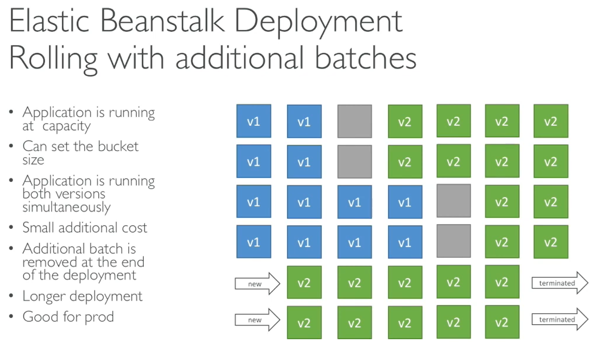
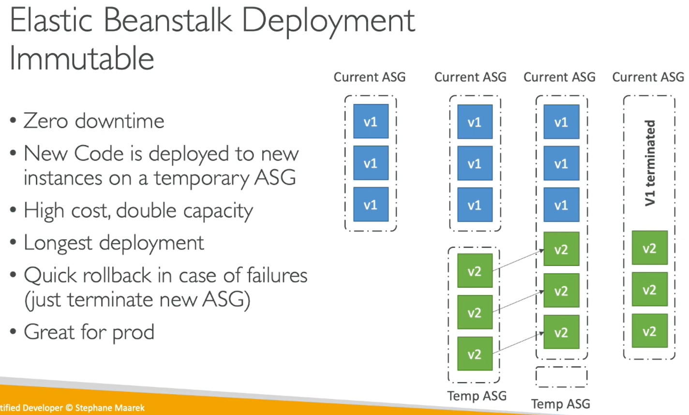
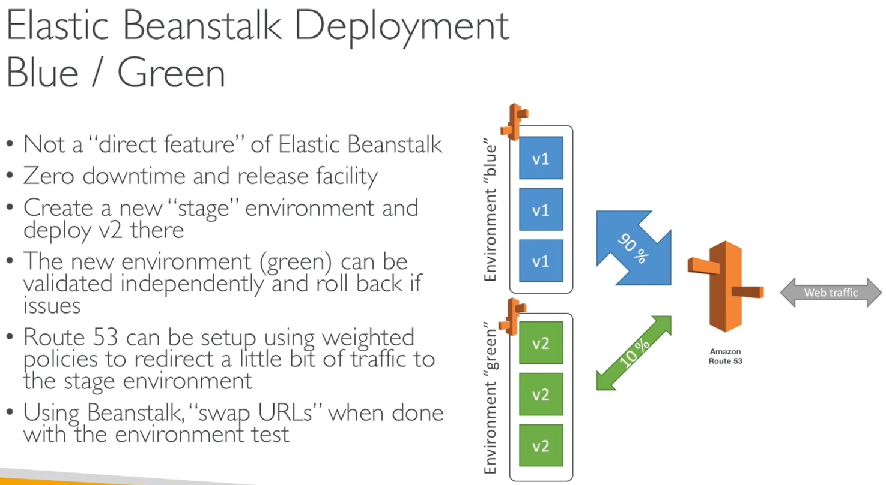
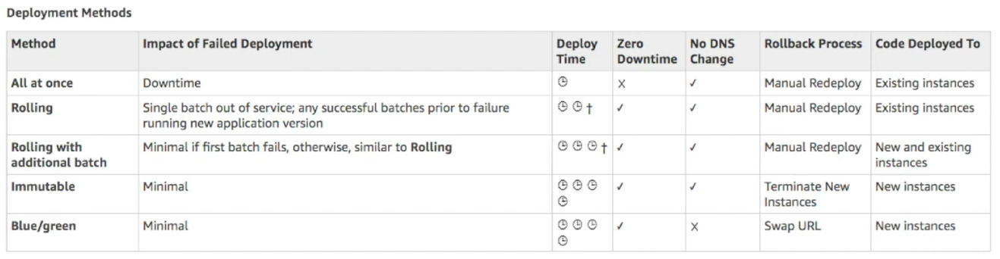

# Generic Stuff

## AWS

## AWS System Manager Parameter Store

AWS Parameter store it's a way to store your parameters and secrets.

- Secure storage for configuration and secrets.
- Optional Seamless Encryption using KMS.
    KMS - AWS Key Management Service (AWS KMS) lets you create, manage, and control cryptographic keys across your applications and AWS services.
- Serverless, scalable, durable, easy SDK, free.
- Version tracking of configurations / secrets.
- Configuration management using path & IAM.
    Using &IAM you can restrict, who can view which database passwords.  
    also need to define KMS policies to allow someone to decrypt this secret.
- Notifications via CloudWatch event of any secrets changing.
- Integration with cloud formation -- it rhymes.
    Just in case you need you need to have your parameters store feed information to your clound formation template.

### Workflow

If it's plaintext secret, then parameter store will check IAM permissions.  
If it's encrypted, additionally AWS KMS will be involved.

### AWS Parameter Store Hierarchy

You can set up a hierarchy structure for your secrets.

Example:

- /my-department/
  - my-app
    - dev/
      - db-url
      - db-password
    - prod/
      - db-url
      - db-password
  - other-app/
- /other-department

## Elastic BeanStalk

### Beanstalk Deployment Modes

- Single instance - great for dev
- High Availability with Load Balancer - Great for prod

#### Beanstalk Deployment Options for Updates

- __All at once (deploy all in one go):__ fastest, but instances aren't available to serve traffic for a bit (downtime)
- __Rolling:__ update a few instances at a time (bucket), and then move onto the next bucket once the first bucket is healthy
- __Rolling with additional batches:__ like rolling, but spins up new instances to move the batch (so that the old application is still available)
- __Immutable:__ spins up new instances in a new ASG, deploys version to these instances, and then swaps all the instances when everything is healthy

#### Beanstalk Deployment - All at once

#### Beanstalk Deployment - Rolling

#### BeanStalk Deployment - Rolling with additional batches

__Exam Tip:__ Sometimes the exam will ask you, if there is an additional cost.

#### BeanStalk Deployment - Immutable

- First it starts one v2 instance, after health checks pass, it launches the rest.
- In the firt stage it merges temporairy ASG with current ASG.

__ASG__ - Auto Scaling Group

#### Elastic Beanstalk Deployment - Blue / Green

- Not a "direct feature" of Elastic Beanstalk
- Zero downtime and release facility

### Elastic Beanstalk Deployment Summary from AWS Doc

- <https://docs.aws.amazon.com/elasticbeanstalk/latest/dg/using-features-deploy.existing-version.html>

## AWS Opsworks

__Exam Tip:__ chef & Puppet needed => AWS Opsworks

__Note:__ Skiping for now

## AWS Cofnig

Dumps all our resources. - under construction

- Helps with auditing and compliance of your AWS resources
- Helps record configurations and changes over time
- Helps record compliance over time
- Possibility of storing AWS Config data into S3 (can be queried by Athena)
- Questions, that can be solved by AWS Config:
  - Is there unrestricted SSH access to my security groups?
  - Do my buckets have any public access?
  - How has my ALB configuration changed over time?
- You can receive alerts (SNS notifications) for any changes
- AWS Config is a per-region service
- Can be aggregated across regions and accounts

### AWS Confir - Config Rules

- Can use AWS managed config rules (over 75)
- Can make custom rules (must be defined in AWS Lambda)
  - Evqaluate if each EBS disk is of type gp2
  - Evaluate if each EC2 instance is t2.micro
- rules can be evaluated triggered:
  - for each config change
  - And / or: at regular time intervals
- Pricing:
  - No free tier

## Scaling Processes in ASG

- Launch: Add a new EC2 to the group, increasing the capacity
- Terminate: Removes an EC2 instance from the group, decreasing its capacity. 
- HealthCheck: Checks the health of the instances
- ReplaceUnhealthy: Terminate unhealthy instances and re-create them
- AZRebalance: Balance the number of EC2 instances across AZ
- AlarmNotification: Accept notification from CloudWatch
- ScheduledActions: Performs scheduled actions that you create.
- AddToLoad Balancer: Adds instances to the load balancer or target group
- We can suspend these processes!

## AWS Systems Manager Overview

- Helps you manage your EC2 and on-Premise systems at scale
- Get operational insights about the state of your infrastructure
- Easliy detect problems
- Patching automation for enhanced compliance
- Works for both Windows and Linux OS
- Integrated with Cloudwatch metrics / dashboards
- Integrated with AWS Config
- Free service

